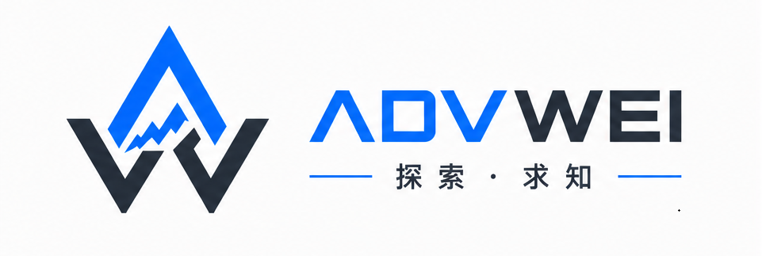

<p align="center">
  
</p>

<h3 align="center">基于VeOps CMDB二开的运维配置管理数据库</h3>

<h3 align="center">
  <a href="https://github.com/veops/cmdb">原项目链接</a>
</h3>

<p align="center">
  <a href="https://github.com/advwei/JW-CMDB/LICENSE"></a>
  <a href="https:https://github.com/sendya/ant-design-pro-vue"></a>
  <a href="https://github.com/pallets/flask"></a>
</p>
<p align="center">
  中文(简体) · <a href="docs/README_en.md">English</a>
</p>

## 系统介绍

本项目是用Codex + Opencode两个AI agent工具，基于维易CMDB开源项目进行二开，未删减原本功能只是增加了以下功能：
-  新增Jumpserve资产同步
-  新增IPAM Agent 及同步服务
-  新增Ansible对接中间件
-  新增Ansible执行日志板块
-  新增两个固定资产模型
-  新增回收资源显示板块
-  新增配置中心

## 新增说明

### 1. 新增目录结构
```shell
cmdb_ts
│
├── ci_models               # 资产模型
├── cmdb-agent              # Agent服务器相关代码
├── cmdb-ansible-executor   # Ansible中间服务
├── tools                   # IP批量同步工具
└── ...
```

### 2. 新增功能

- **集成Jumpserve**：支持将记录的资产单独或批量推送到Jumpserve堡垒机，回收时自动删除Jumpserve对应资产。
- **集成Ansible**：支持动态生成inventory，自定义选择执行playbook，前端自定义输入额外参数。
- **新增IPAM Agent**：支持子网单次全量扫描（UI 右键触发），Agent增加HTTP服务与docker后端交互。
- **资产模型**：增加vmserver模型记录资产，delserver模型用于记录回收资产，其他模型依旧支持自定义。
- **Ansible执行日志**：前端可视化查看Ansible任务的成功/失败执行情况，详细查看具体主机信息及Ansible执行的标准及错误输出。
- **回收资源**：
    + 支持一键批量回收资源，支持三维度统计回收资源概览视图（CPU、内存、硬盘）。
    + 点击回收后会把资产从vmserver模型删除添加到delserver模型中，同步删除Jumpserve资产和回收IP地址。
    + 取消回收仅回退资产数据不会同步创建新Jumpserve资产和IP地址，操作需慎重。
- **配置中心**：集中管理，集成Jumpserve、ansible、agent、资产模型IP配置页面。
    + Jumpserve配置： 对接配置、资产节点 UUID 映射、资产类型映射
    + Ansible配置： Ansible Executor对接配置、CI 字段映射、OS 凭证映射
    + Agent配置： AgentID、地址、端口、token
    + 模型配置： vmserver、delserver模型ID配置

## 技术栈

+ 后端：Python [3.8-3.11]
+ 数据存储：MySQL、Redis
+ 前端：Vue.js
+ UI组件库：Ant Design Vue

## 系统概览

<table style="border-collapse: collapse;">
  <tr>
    <td style="padding: 5px;background-color:#fff;">
      
    </td>
    <td style="padding: 5px;background-color:#fff;">
      
    </td>
  </tr>

  <tr>
    <td style="padding: 5px;background-color:#fff;">
      
    </td>
    <td style="padding: 5px;background-color:#fff;">
      
    </td>
  </tr>

  <tr>
    <td style="padding: 5px;background-color:#fff;">
      
    </td>
    <td style="padding: 5px;background-color:#fff;">
      
    </td>
  </tr>

  <tr>
    <td style="padding: 5px;background-color:#fff;">
      
    </td>
    <td style="padding: 5px;background-color:#fff;">
      
    </td>
  </tr>

</table>

## 快速开始

### 1. 安装依赖拉取代码
- 第1步: 安装 Docker 环境和 Docker Compose（v2）
- 第2步: 在/opt目录下拷贝项目代码,  `git clone https://github.com/advwei/cmdb_ts.git`

### 2. 构建前后端镜像
+ Docker 快速构建

  - 第1步：进入主目录构建前端镜像
    + 后端：名字要和docker-compose.yml中一致
    ```bash
    docker build -f docker/Dockerfile-API -t my-cmdb-api:2.8.6 .
    ```
    第2步：进入主目录构建后端镜像
    + 前端：名字要和docker-compose.yml中一致
    ```bash
    docker build -f docker/Dockerfile-UI -t my-cmdb-ui:2.8.6 .
    ```

### 3. Agent部署

  #### 一键安装
  ```bash
  # 进入项目Agent文件夹，执行一键安装
  cd /JW-CMDB/cmdb-agent
  sudo bash install.sh
  ```
  #### 其他说明
  - 其他安装方式及内容介绍请参考 [Agent介绍文档](cmdb-agent/AgentReadMe.md)

### 4. ansible中间服务部署
  #### 前提条件

  - 宿主机已安装 Ansible
  - Ansible 剧本目录: `/opt/ansible/playbooks/`
  - Ansible 清单目录: `/opt/ansible/inventory/`

  #### 部署服务
```bash
  # 进入 cmdb-ansible-executor 目录安装依赖
  cd /opt/JW-CMDB/cmdb-ansible-executor
  pip install -r requirements.txt

  # 编辑 cmdb-ansible.service 中的 EXECUTOR_API_KEY
  # 配置 systemd
  cp cmdb-ansible.service /etc/systemd/system/
  systemctl daemon-reload
  systemctl enable cmdb-ansible
  systemctl start cmdb-ansible

  # 验证
  curl http://localhost:18081/api/exec/health
```

  #### 其他说明
  - 其他介绍请参考 [Ansible介绍文档](cmdb-ansible-executor/AnsibleReadMe.md)

### 5. 访问
- 进入项目目录`cd /opt/JW-CMDB`
- 启动镜像, `docker compose up -d`
- 打开浏览器并访问: [http://127.0.0.1:8000](http://127.0.0.1:8000)
- 用户名: admin
- 密码: 123456

  
### 6. 导入模型

  #### 导入vmserver和delserver模型
- 把ci_models目录文件夹下的模型文件导入系统[模型配置-导入-选择文件上传]
- 查看vmserver和delserver模型的ID，再配置中心的模型中填入对应的ID值
  + (F12打开浏览器检查点击模型查看对应接口：/api/v0.1/ci_types/{id}即可知道ID)
- 修改IP地址模型里面的用途属性来和资产关联，编辑属性-下拉列表-其他模型属性-vmserver-资产名：

|属性名|别名(可自定义)|数据类型|下拉列表|
|:------:|:--------------:|:--------:|:--------:|
|usage|使用资产|短文本|其他模型属性-vmserver-资产名|

  #### 批量关联IP地址
- 想要批量关联已经在线的IP和资产可以使用，/tools/ip_import_tools.py脚本
- 修改URL, KEY, SECRET
- 按模板填写Excel表格然后执行脚本即可

|ip|资产名|
|:------:|:-------:|
|ip|usage|
|10.0.0.0|tomcat_10.0.0.0_张三|

## FQA
  问题处置[FQA文档](docs/FQA.md)

## 致谢
  本项目为新手利用AI 工具基于开源项目 VeOps CMDB 二次开发，感谢原项目所有贡献者及VeOps团队！！！

## 相关文章

- <a href="https://github.com/veops/cmdb/tree/master/docs/cmdb_api.md" target="_blank">CMDB接口文档</a>
- <a href="https://github.com/veops/cmdb" target="_blank">原项目地址</a>
